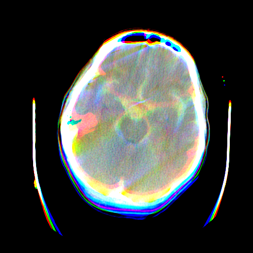
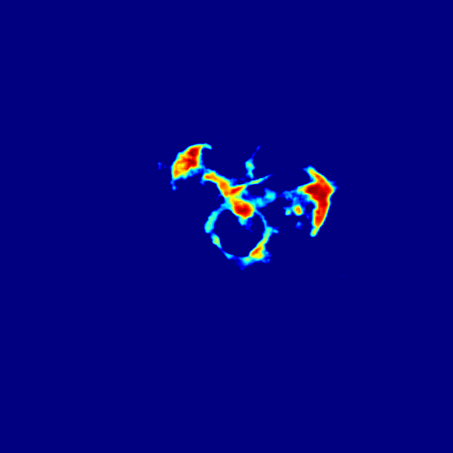

# Weakly-Supervised-LSE-Training-for-Efficient-Segmentation
This is the official implementation of our work "Towards Efficient and Scalable Subtype Segmentation of Intracranial Hemorrhage with the Aid of Weakly-Supervised Annotations"

  
